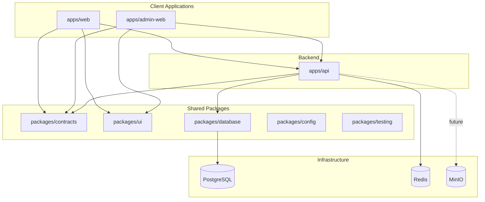
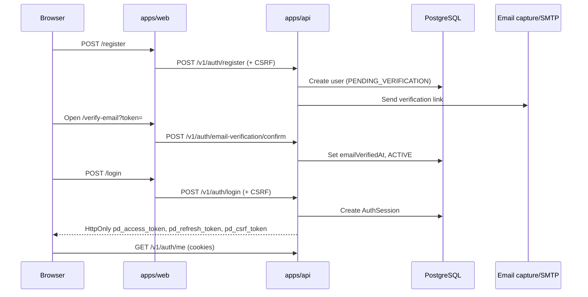

# Architecture

## Overview

PitchDeck Nigeria uses a Turborepo monorepo with three applications and five shared packages.



## Application boundaries

### `apps/web`

Public Next.js App Router application for innovators and sponsors.

- Marketing landing page and onboarding flows
- Registration with role, Nigerian state, and terms acceptance
- Login, email verification, password reset, account and session management
- Browser API client with CSRF preflight and `credentials: "include"`

Protected account routes redirect unauthenticated visitors to `/login` via client-side `/auth/me` checks.

### `apps/admin-web`

Next.js admin console with server-side protection on the `(protected)` route group.

- Admin login rejects non-admin roles
- Dashboard and user management screens
- Role assignment UI with state requirement for STATE_ADMIN
- Access denied page for authenticated non-admin users

### `apps/api`

NestJS service exposing versioned REST endpoints under `/v1`.

- Config module with Zod env validation
- Prisma for PostgreSQL, ioredis for Redis
- Global JWT + CSRF guards, response envelope, structured logging
- Auth module (register, login, refresh, sessions, verify, reset)
- Admin module (scoped user/role management)
- Email service with `log`, `smtp`, or in-memory `capture` provider

## Identity lifecycle



1. **Registration** — Public users submit email, password, profile, role, state, and terms acceptance. Passwords are hashed with Argon2id.
2. **Verification** — Opaque single-use tokens stored hashed in `email_verification_tokens`. Unverified users cannot sign in.
3. **Login** — Valid credentials create a refresh session; access JWT and refresh token are set as HttpOnly cookies; CSRF token is readable by JavaScript.
4. **Refresh** — `POST /v1/auth/refresh` rotates refresh tokens. Reuse revokes the token family and is audit-logged.
5. **Logout** — Current session revoked; cookies cleared on `/auth/logout`.
6. **Password reset** — Forgot endpoint is non-enumerating; reset revokes all refresh sessions.

## Browser session flow

| Cookie | HttpOnly | Purpose |
| ------ | -------- | ------- |
| `pd_access_token` | yes | Short-lived JWT |
| `pd_refresh_token` | yes | Opaque refresh token |
| `pd_csrf_token` | no | CSRF double-submit value |

Mutating API requests from browsers must include `X-CSRF-Token` matching the CSRF cookie and originate from an allowed `Origin`.

## Authorization

| Role | Scope | Admin API |
| ---- | ----- | --------- |
| SUPER_ADMIN | Global | Full access |
| NATIONAL_ADMIN | Nigeria (NG) | Nationwide read |
| STATE_ADMIN | Single state | Users in assigned state only |
| INNOVATOR/SPONSOR/REVIEWER/MENTOR | Global (auth) | No admin endpoints |

State isolation applies to:

- Admin user list filtering (`user.stateId` and scoped role assignments)
- Direct `/admin/users/:id` access checks

Bootstrap super admin is created via `pnpm admin:bootstrap` (env vars, not seed).

## Supporting services

| Service | Role |
| ------- | ---- |
| PostgreSQL | Users, roles, sessions, tokens, audit logs, reference data |
| Redis | Rate limits, future caching |
| MinIO | Deferred file uploads |
| Email capture | E2E/dev-only in-memory mailbox at `/v1/test/emails` |

## Shared packages

| Package | Responsibility |
| ------- | -------------- |
| `@pitchdeck/contracts` | Enums, auth DTOs, API envelopes, Zod schemas |
| `@pitchdeck/database` | Prisma client, schema, migrations, seeds, bootstrap |
| `@pitchdeck/ui` | Accessible React components and theme tokens |
| `@pitchdeck/config` | ESLint, TS, Tailwind, Prettier presets |
| `@pitchdeck/testing` | Unit factories and Playwright/API E2E helpers |

## API response contract

All successful API responses:

```json
{
  "success": true,
  "data": {},
  "meta": {
    "requestId": "uuid",
    "timestamp": "ISO-8601"
  }
}
```

Errors:

```json
{
  "success": false,
  "error": {
    "code": "ERROR_CODE",
    "message": "Human-readable message"
  },
  "meta": {
    "requestId": "uuid",
    "timestamp": "ISO-8601"
  }
}
```

## Health checks

| Endpoint | Purpose |
| -------- | ------- |
| `GET /v1/health` | General status and uptime |
| `GET /v1/health/live` | Process liveness |
| `GET /v1/health/ready` | Dependency readiness (PostgreSQL, Redis) |

## Local development topology

Docker Compose provides PostgreSQL, Redis, and MinIO on host-mapped ports 15432, 16379, and 19000/19001. Applications run on the host via `pnpm dev`.

Playwright E2E starts the API and target web app automatically; Docker must be running for database and Redis.

## Deployment notes

Production deployment guidance lives in [DEPLOYMENT.md](./DEPLOYMENT.md). Nginx config placeholder is in `infrastructure/nginx/default.conf`.
