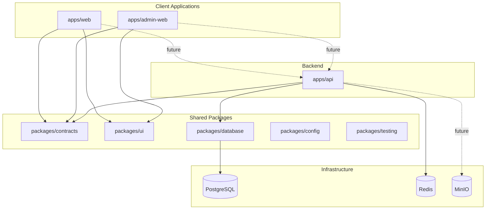

# Architecture

## Overview

PitchDeck Nigeria uses a Turborepo monorepo with three applications and five shared packages.



## Application boundaries

### `apps/web`

Public Next.js App Router application for innovators and sponsors. Uses shared UI theme tokens and renders marketing/onboarding shells.

### `apps/admin-web`

Next.js admin console. Protected routes are grouped under `(protected)` for future auth middleware integration.

### `apps/api`

NestJS service exposing versioned REST endpoints under `/v1`. Uses:

- Config module with Zod env validation
- Prisma for PostgreSQL access
- ioredis for Redis connectivity
- Global response envelope interceptor
- Global exception filter (no stack traces in production)

## Shared packages

| Package | Responsibility |
| ------- | -------------- |
| `@pitchdeck/contracts` | Enums, API envelopes, Zod schemas (browser-safe) |
| `@pitchdeck/database` | Prisma client, schema, migrations, seeds |
| `@pitchdeck/ui` | Accessible React components and theme tokens |
| `@pitchdeck/config` | ESLint, TS, Tailwind, Prettier presets |
| `@pitchdeck/testing` | Test factories and dev env placeholders |

## API response contract

All successful API responses:

```json
{
  "success": true,
  "data": {},
  "meta": {
    "requestId": "uuid",
    "timestamp": "ISO-8601"
  }
}
```

Errors:

```json
{
  "success": false,
  "error": {
    "code": "ERROR_CODE",
    "message": "Human-readable message"
  },
  "meta": {
    "requestId": "uuid",
    "timestamp": "ISO-8601"
  }
}
```

## Health checks

| Endpoint | Purpose |
| -------- | ------- |
| `GET /v1/health` | General status and uptime |
| `GET /v1/health/live` | Process liveness |
| `GET /v1/health/ready` | Dependency readiness (PostgreSQL, Redis) |

## Local development topology

Docker Compose provides PostgreSQL, Redis, and MinIO on host-mapped ports 15432, 16379, and 19000/19001 (defaults via POSTGRES_HOST_PORT, REDIS_HOST_PORT, MINIO_*_HOST_PORT) respectively. Applications run on the host via `pnpm dev`.

## Deployment notes

Production deployment guidance lives in [DEPLOYMENT.md](./DEPLOYMENT.md). Nginx config placeholder is in `infrastructure/nginx/default.conf`.

